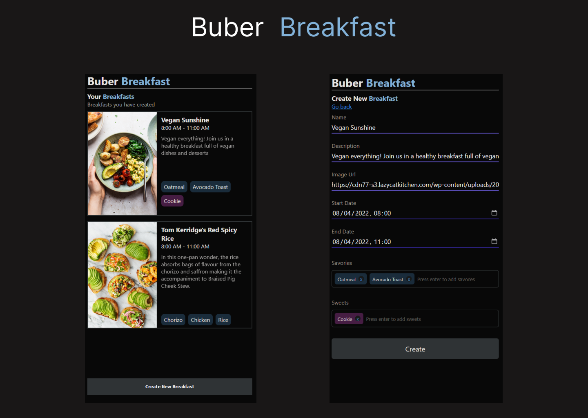

<div align="center">




---

### A Small React Project with .NET API Integration

</div>

- [Overview](#overview)
- [Technologies](#technologies)
- [API Definition](#api-definition)
    - [Create Breakfast](#create-breakfast)
    - [Create Breakfast Response](#create-breakfast-response)
- [Get Breakfast](#get-breakfast)
    - [Get Breakfast Request](#get-breakfast-request)
- [Credits](#credits)
- [Disclaimer](#disclaimer)

# Overview

I made this small project with the primary goal of enhancing my React skills. Leveraging the knowledge gained from a [comprehensive .NET 6 API course](https://youtu.be/PmDJIooZjBE), I seamlessly integrated the backend, resulting in a well-rounded learning experience.

## Technologies

- **React:**
- **.NET 6 API:**
- **dotnet CLI**
- **Visual Studio Code**
- **Visual studio Code Extensions**
- **Commitlint**

# Api Definition

```js
POST /breakfasts
```

```json
{
    "name": "Vegan Sunshine",
    "description": "Vegan everything! Join us for a healthy breakfast..",
    "startDateTime": "2022-04-08T08:00:00",
    "endDateTime": "2022-04-08T11:00:00",
    "savory": [
        "Oatmeal",
        "Avocado Toast",
        "Omelette",
        "Salad"
    ],
    "Sweet": [
        "Cookie"
    ],
    "ImageURL": "https://cdn77-s3.lazycatkitchen.com/wp-content/uploads/2019/04/vegan-breakfast-bowl-portion-1000x1500.jpg"
}
```

### Create Breakfast Response 

```js
201 Created
```

```yml
Location: {{host}}/Breakfasts/{{id}}
```

```json
{
    "id": "00000000-0000-0000-0000-000000000000",
    "name": "Vegan Sunshine",
    "description": "Vegan everything! Join us for a healthy breakfast..",
    "startDateTime": "2022-04-08T08:00:00",
    "endDateTime": "2022-04-08T11:00:00",
    "lastModifiedDateTime": "2022-04-06T12:00:00",
    "savory": [
        "Oatmeal",
        "Avocado Toast",
        "Omelette",
        "Salad"
    ],
    "Sweet": [
        "Cookie"
    ],
    "ImageURL": "https://cdn77-s3.lazycatkitchen.com/wp-content/uploads/2019/04/vegan-breakfast-bowl-portion-1000x1500.jpg"
}
```

## Get Breakfast

### Get Breakfast Request

```js
GET /breakfasts/{{id}}
```

### Get Breakfast Response

```js
200 Ok
```

```json
{
    "id": "00000000-0000-0000-0000-000000000000",
    "name": "Vegan Sunshine",
    "description": "Vegan everything! Join us for a healthy breakfast..",
    "startDateTime": "2022-04-08T08:00:00",
    "endDateTime": "2022-04-08T11:00:00",
    "lastModifiedDateTime": "2022-04-06T12:00:00",
    "savory": [
        "Oatmeal",
        "Avocado Toast",
        "Omelette",
        "Salad"
    ],
    "Sweet": [
        "Cookie"
    ]
}
```

# Credits

- [ErrorOr](https://github.com/amantinband/error-or) - A simple, fluent discriminated union of an error or a result.

- [Axios](https://github.com/axios/axios) -
  - Axios is employed for making HTTP requests in a straightforward and efficient manner. It simplifies data fetching and ensures seamless communication with backend services.

- [React Router DOM](https://reactrouter.com/) -
  - React Router DOM facilitates navigation and routing in React applications. It ensures a smooth and intuitive user experience by enabling the creation of dynamic, single-page applications with navigational capabilities.

# Disclaimer

This is an educational project.